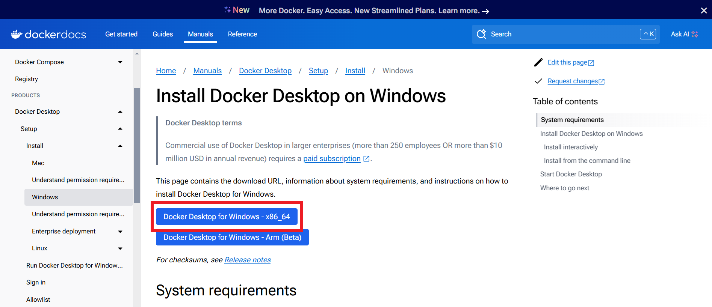
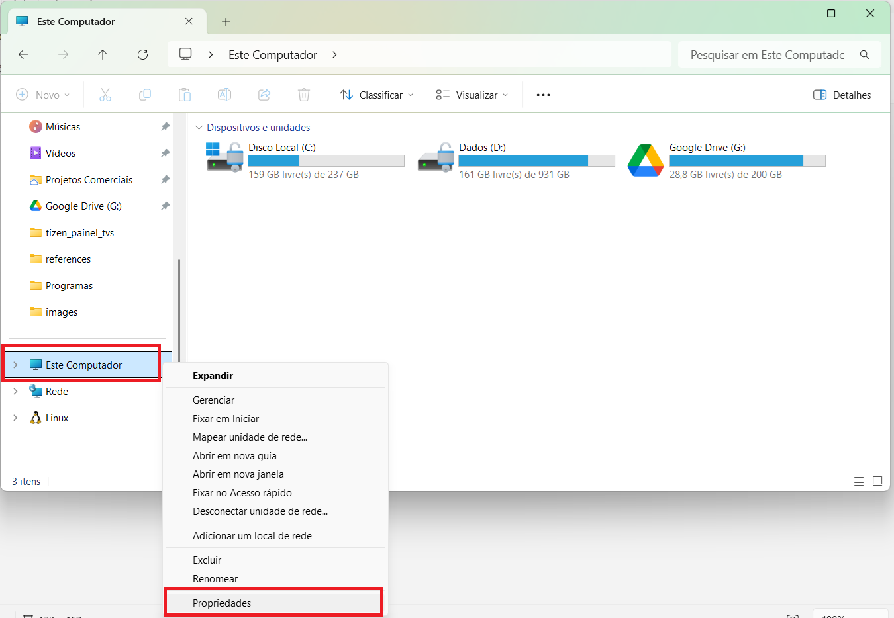
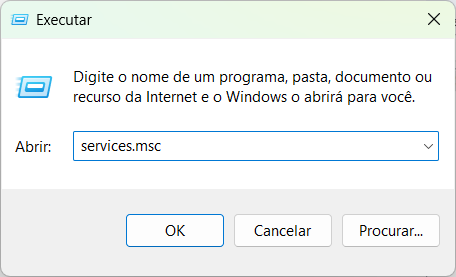

# Instalação

Para começar a utilizar o DashPulse, o processo de instalação foi simplificado para garantir que você possa configurar a aplicação de forma rápida e eficiente. O ponto chave é ter o Docker devidamente instalado e configurado em sua máquina com Windows. Isso é essencial, pois o DashPulse utiliza um arquivo docker-compose.yml que automatiza o processo de configuração dos serviços necessários, como o Broker Mosquitto, servidores back-end em Python e o ambiente front-end.

O Docker garante que todo o ambiente seja executado em contêineres isolados, eliminando problemas de compatibilidade e permitindo que a aplicação rode de forma consistente em qualquer sistema. Com o Docker e o docker-compose, você pode iniciar o DashPulse com apenas alguns comandos, garantindo a experiência ideal para visualização e monitoramento de dados em tempo real. Não tem o Docker? Instale agora para desbloquear todo o potencial do DashPulse!

## **Docker**

### Realizando download do Docker

Acesse a página para realizar download do [docker para Windows](https://docs.docker.com/desktop/setup/install/windows-install/)

Clique no botão `Docker Desktop for Windows - x86_64`



Na janela que surge selecione o local onde deseja salvar o arquivo e clica no botão salvar.


### Iniciando a instalção do Docker
1. Acesse o local onde salvou o arquivo e clique duas vezes sobre `Docker Desktop Installer.exe`
2. O Windows abrirá a janela de execução como administrador, você deve clicar em **sim** para confirmar a execução.
3. Na pré-configuração do docker ele recomendará utilizar o WSL com o Hyper-V para melhor desempenho do software. Deixa marcada todas as opção e clica em `OK`


Aguarde enquanto o software descompacta os arquivos necessários para instalação.


Após a descompatação o docker irá iniciar o processo de instalação, uma vez finalizado clique no botão `Close and log out` para finalizar essa etapa.


Sua máquina será reiniciada automaticamente e na próxima janela do docker que surgirá você clicará no botão `Accept` para confirmar os termos de uso do serviço da aplicação.


Selecione uma forma de realizar o login no docker, caso não tenha cadastro, realize cadastro na plataforma.


Selecione os itens de interesse para uso do docker, caso não tenha nenhum em específico clique em `skip`.


Pronto! Agora você pode utilizar os recursos do Docker Desktop instalado em sua máquina.


## **Broker Mosquitto**
O Eclipse Mosquitto é um dos `brokers MQTT` de código aberto mais populares do mundo. Nessa etapa 
será apresentado como instalar e configurar o `Mosquitto MQTT Broker` no Windows , 
incluindo como instalar o Mosquitto como um serviço do Windows. 
Em seguida, explicaremos como testar seu broker usando os comandos: `mosquitto_sub` e `mosquitto_pub`.

### Baixando broker mosquitto
Para instalar o Mosquitto no Windows, selecione o arquivo de instalação desejado em  [mosquitto.org](https://mosquitto.org/files/binary/win64/)  (64 bits ou 32 bits), baixe-o e execute-o. 
Recomendo utilizar a mesma versão do artigo para não ocorrer divergências.

!!! warning "Versão utilizada no artigo"
    `mosquitto-2.0.15`


O assistente de configuração do Eclipse Mosquitto será iniciado. Clique em Next para continuar a instalação.


Selecione os componentes a serem instalados. Se você quiser iniciar o Mosquitto automaticamente 
quando o Windows iniciar, instale o componente Service. Ele instalará o 
broker como um serviço do Windows.

Você também precisará  do Visual Studio 
Runtime porque o Mosquitto depende de bibliotecas e componentes específicos fornecidos por ele. 
Deixe essa opção como está e continue para a próxima etapa.


Selecione a pasta de instalação do Eclipse Mosquitto ou 
deixe o valor padrão `C:\Program Files\mosquitto` e clique em Instalar.


Após o processo de instalação ser concluído, você verá uma mensagem correspondente. 
Todos os arquivos necessários para operar o Mosquitto serão salvos automaticamente 
na pasta de instalação escolhida. Clique em Finish  no assistente de configuração. 
Agora, você pode começar a usar o MQTT Mosquitto Broker no Windows.


!!! note "Nota"
    O Mosquitto não é automaticamente visível globalmente no `cmd`. 
    Para trabalhar com ele no `prompt`, você deve estar dentro da pasta de instalação 
    ou adicionar a pasta de instalação à variável de ambiente PATH e reiniciar o prompt de comando.
    Esse item será apresentado na próxima seção.

### Mosquitto no path do sistema
Você pode usar o `Mosquitto` diretamente da pasta de instalação navegando 
até essa pasta instalada no `prompt de comando` e digitando `mosquitto`. 
No entanto, se quiser usar o broker de qualquer local no terminal de comando, 
você precisa adicioná-lo ao seu caminho do sistema especificando à variável de ambiente PATH.

Para adicionar o `Mosquitto` ao caminho do sistema, copie o caminho da pasta de instalação, 
que contém mosquitto.exe. Caso não tenha alterado o caminho de instalação ele deverá ficar em:

```
C:\Program Files\mosquitto
```

Abra o windows explorer e clique bom o botão direito no ícone `este computador` e selecione a opção `propriedades`



Clique em Configurações avançadas do sistema. Clique em  Variáveis ​​de Ambiente, como você pode ver na imagem abaixo.


Localiza a seção variáveis do sistema selecione o item `Path` e clique no botão `Editar`.


Agora, a janela `Editar a variável de ambiente` será aberta. Clique em `Novo` e insira o caminho para a pasta de instalação do `Mosquitto` que você copiou anteriormente. Clique em  OK


Pronto! Agora o broker Mosquitto já está configurado para funcionar em todo sistema.

### Mosquitto como serviço

!!! warning "Alerta"
    A maioria dos comandos desta seção deve ser executada com permissões administrativas. Para fazer isso, você deve executar o Prompt de Comando como administrador clicando com o botão direito do mouse no ícone da linha de comando e escolhendo a opção `Executar como administrador`.

Por padrão, se a opção `Serviço` foi marcada durante a instalação, o `Mosquitto` é instalado como um serviço do Windows para rodar em segundo plano e iniciar automaticamente na inicialização do Windows. Note que, neste caso, o `Mosquitto` usará o arquivo de configuração mosqutto.conf do diretório de instalação padrão.

Para ativar você deve utilizar as teclas ++windows+r++ digite o comando `services.msc` e clique em ok para continuar



Localize o serviço `Mosquitto Broker` pressione o botão direito e selecione a opção propriedades para selecionar a opção início automático.


Com a opção das propriedades do serviço do `Mosquitto Broker` aberto selecione a opção tipo de inicialização `automático` e clique no botão `iniciar`


### Executando Broker Mosquitto

Nessa etapa será verificado se o broker Mosquitto está funcionando perfeitamente, para isso, é necessário utilizar os comandos `mosquitto_sub` e `mosquitto_pub` cada um deles com funcionalidades distintas:

- `mosquitto_sub` é o comando para o terminal receber as mensagem disparadas
- `mosquitto_pub` é o comando para o terminal disparar as mensagens aos terminais destinatários

Pressione as teclas ++windows+r++ digite o comando `cmd` e pressione ++enter++

Nesse primeiro terminal você deverá colar o código abaixo:

```
mosquitto_sub -h localhost -t teste
```


!!! success "Explicando os parâmetros"
    - `-h` determina o `host` de acesso do broker, como está sendo executado o comando localmente, nesse caso, é necessário adicionar `localhost`.
    - `-t` informa qual `tópico` está aguardando as mensagens.

Abra um **novo terminal** pressionando as teclas ++windows+r++ digite o comando `cmd` e pressione ++enter++ para realizar o envio das mensagens ao terminal que está com o comando `mosquitto_sub`. No novo terminal digite o comando abaixo:

```
mosquitto_pub -h localhost -t teste -m "Mensagem de teste"
```
!!! success "Explicando os parâmetros"
    - `-h` determina o `host` de acesso do broker, como está sendo executado o comando localmente, nesse caso, é necessário adicionar `localhost`.
    - `-t` informa qual `tópico` está aguardando as mensagens.
    - `-m` permite o envio de mensagens personalizadas.


Caso tenha seguido todos os passos, no terminal que foi enviado o comando mosquitto_sub deverá apresentar a mensagem enviada, assim como está presente na imagem abaixo:


O `Broker Mosquitto` foi instalado, configurado e testado perfeitamente.

### Configurando arquivo Mosquitto.conf

O `Broker Mosquitto` utiliza o MQTT (*Message Queuing Telemetry Transport*) é um protocolo leve e eficiente, ideal para comunicação em tempo real entre dispositivos com recursos limitados, como sensores IoT, dispositivos móveis ou sistemas distribuídos. Ele é amplamente utilizado devido à sua baixa latência, confiabilidade e simplicidade na publicação/assinatura de mensagens.

No projeto **DashPulse** são utilizadas as portas:

- ``1883`` é a porta padrão do protocolo MQTT para conexões não criptografadas.
Essa porta é comumente usada em dispositivos IoT e sistemas onde a criptografia não é um requisito prioritário.

- ``8081`` é a porta utilizada para conexões seguras (SSL/TLS) em implementações MQTT. É por essa porta que o DashPulse recebe os comandos para abrir as páginas em HTML nos painéis.

- ``allow_anonymous`` permite que dispositivos ou clientes MQTT se conectem ao broker sem autenticação (sem necessidade de usuário/senha ou certificado).

Agora precisamos configurar mosquitto.conf para adicionar essas informações importantes.

Acesse o local de instalação do `Mosquitto`:

```
C:\Program Files\mosquitto
```

Localize o arquivo ``mosquitto.conf`` e abra com qualquer editor de texto pressione as teclas ++ctrl+a++ para selecionar tudo e pressione ++del++ para deletar todo conteúdo do arquivo. Feito isso digite as linhas abaixo no arquivo ``mosquitto.conf``:

```
# Arquivo de configuração do Mosquitto MQTT

# Configuração da porta padrão MQTT (não criptografada)
listener 1883
protocol mqtt

# Configuração da porta para conexões criptografadas (TLS/SSL)
listener 8081
protocol websockets

# Permitir conexões anônimas (sem autenticação)
allow_anonymous true
```

Salve a edição do arquivo no caminho `C:\Program Files\mosquitto` mantendo o mesmo nome ``mosquitto.conf``.

## **Clonando projeto**

### Pré-requisitos

1. Instalar o git;
    - Faça o download do Git para Windows [aqui](https://git-scm.com/downloads/win).
    - Após a instalação, você pode abrir o Git Bash ou o Prompt de Comando do Windows.
2. Conta GitHub.
    - Crie sua conta no [github](https://github.com/)
    - Faça login

### Acessando repositório

- Acesse o link do [repositório do projeto](https://github.com/aislansf/tizen_painel_tv_samsung)
- Clique no botão **Code** (verde, no topo da página do repositório).
- Copie o link HTTPS
```
https://github.com/aislansf/tizen_painel_tv_samsung.git
```

### Download do projeto

Abra o git bash no Windows


Acesse o caminho abaixo:

```
cd C:
```

!!! tip "Outros diretórios"
    Você pode navegar para outro diretório de controle de seus projetos

Para realizar o download do projeto para o diretório desejado você deve aplicar o comando abaixo:

```
git clone https://github.com/aislansf/tizen_painel_tv_samsung.git
```


Para verificar se tudo ocorreu bem digite o comando abaixo para visualizar o diretório do projeto em sua máquina:

```
ls
```


Acesse o diretorio `tizen_painel_tv_samsung` e execute o comando `ls` para visualizar todos os arquivos do projeto:

```
cd tizen_painel_tv_samsung && ls
```


Se no seu terminal aparecer os dados como os listados na imagem acima, você conseguiu clonar o projeto com sucesso.

## Editando arquivos do projeto